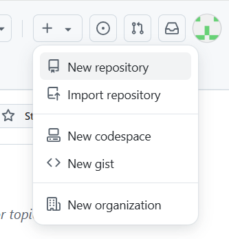
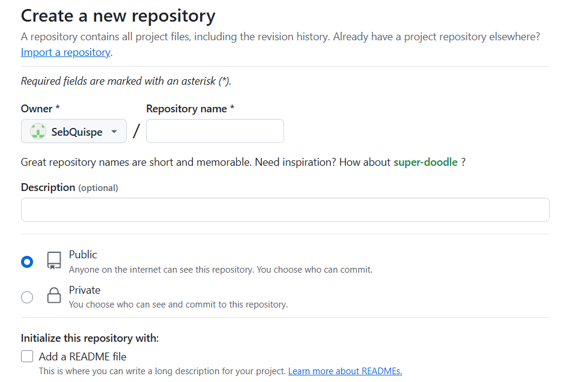
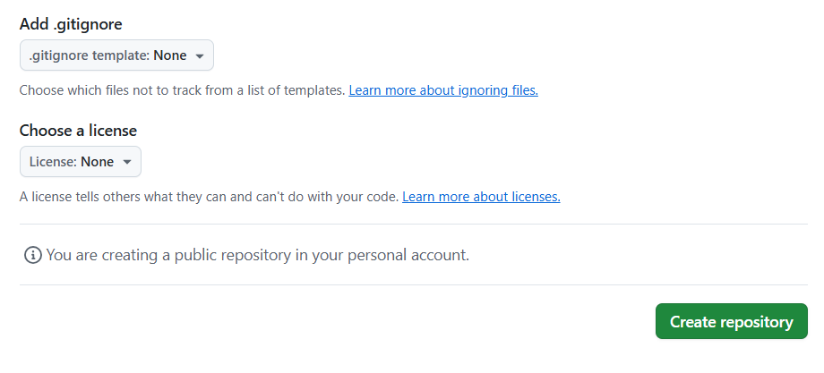
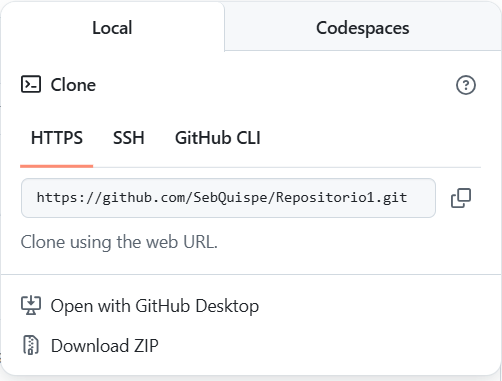

## GESTIÓN DE REPOSITORIOS

### Creación de un repositorio

En el entorno de GitHub, un **repositorio** es un lugar donde se almacena el contenido de un proyecto, tales como códigos, archivos y el historial de revisiones para cada archivo. Pueden tener uno o muchos colaboradores y ser almacenados tanto de manera pública como privada. Existen dos tipos de repositorios: el repositorio local, guardado en una máquina local, y el repositorio remoto, que es alojado en servidores en línea.

1. En la esquina superior derecha de la página de GitHub, hacer clic en el botón **"+"** y luego en **"New repository"**.
2. Escribir un nombre corto para el repositorio, que sea fácil de recordar.
3. Añadir una descripción al repositorio (opcional).
4. Elegir la opción de visibilidad del repositorio, si es **público** (por defecto, visible para cualquier usuario) o privado (visible para el creador y personas que tengan acceso compartido).
5. Teclear el nombre del repositorio, y añade una descripción opcional.
6. Seleccionar la opción "**Initialize this repository with a README**" para crear un archivo Readme (Léame).
7. Añadir un archivo **.gitignore** para omitir la subida de algunos archivos y una **licencia de uso** (ambos opcionales).
8. Hacer clic en el botón **Create repository**.

  

  
  

### Clonación y configuración inicial

Los repositorios en GitHub pueden ser **clonados** mediante una copia integral del repositorio que se almacena en un equipo local. Mediante el repositorio clonado, el usuario puede **realizar modificaciones al proyecto sin alterar el repositorio original**. Para hacer posible el clonado, se necesita tener instalada la plataforma Git.

Pasos para clonar un repositorio en GitHub:
1. En GitHub, ir a la página principal del repositorio que se desea clonar.
2. Encima de la lista de archivos, dar clic al botón verde "**<> Code**".
3. Existen tres opciones para clonar el repositorio: **HTTPS** (la opción más sencilla), **SSH** (si has configurado una clave SSH en Git) y **GitHub CLI** (el editor de comandos de GitHub). Copiar el enlace que aparece en la barra. (por ejemplo, en HTTPS: `https://github.com/usuario/Repositorio.git`)
4. Abrir el programa **Git Bash**.
5. Cambiar el directorio del trabajo actual al directorio (carpeta) en donde se desea clonar el repositorio (con el comando **cd**).
6. Escribir `git clone` seguido del enlace copiado.
7. Presionar el botón **Enter** para proceder con la clonación.

  

Configuración inicial en Git Bash:
1. Una vez clonado el repositorio, ejecutar el comando `git init`.
2. Configurar el nombre de usuario: `git config --global user.name "Tu Nombre"`
3. Configurar el correo electrónico: `git config --global user.email "tuemail@example.com"`
4. Cambiar el nombre de la rama principal (por defecto es "master"): `git config --global init.defaultBranch main`
4. Verifica el estado actual del repositorio: `git status`
5. Añadir todos los cambios al área de preparación: `git add .`
6. Crear un commit a través de Git Bash: `git commit -m "Mensaje del commit"`
7. Subir los cambios al repositorio remoto: `git push origin main`

### Buenas prácticas de organización

**1. Establecer una rama de trabajo:** existen estrategias de flujos de trabajo (*workflows*) que ayudan a facilitar la colaboración, como **Git Feature Branch** y **Gitflow**.

**2. Usar una estructura adecuada en los mensajes de commits:** Los commits deben presentar un mensaje claro que describan los cambios realizados en el proyecto. Se recomienda usar términos como **feat** (nueva característica añadida), **fix** (reparación de errores), **docs** (cambios en documentación), etc.

**3. Enviar tus cambios en un pull-request:** Los *pull-requests* son importantes porque permiten que el propietario del código pueda hacer una revisión al avance realizado antes de aprobarlo y pasarlo a la rama final.

**4. Mantener una documentación clara y actualizada:** Es fundamental contar con un archivo README.md que explique el propósito del proyecto, cómo instalarlo, cómo usarlo y cualquier otra información relevante.