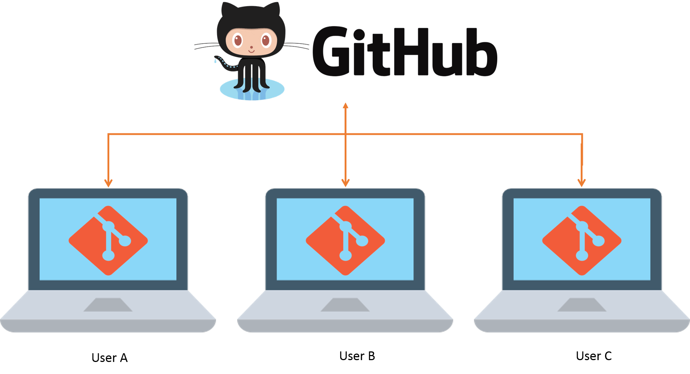

# Buenas Prácticas en el Uso de GitHub

Aplicar buenas prácticas al trabajar con Git y GitHub permite mantener un proyecto limpio, organizado y colaborativo. Aquí recopilamos algunas recomendaciones esenciales para equipos y proyectos individuales.

---

## ✅ Buenas prácticas generales

- **Commits claros y frecuentes**  
  Escribe mensajes de commit descriptivos, por ejemplo:  
  `feat: agregar sección de Codespaces` o `fix: corregir error en tabla Markdown`.

- **Uso de ramas (branches)**  
  Crea ramas para nuevas características o correcciones en lugar de trabajar directamente en `main`.

  Ejemplo:  
  `git checkout -b documentacion/codespaces`

- **Pull Requests (PRs)**  
  Usa pull requests para revisar cambios antes de integrarlos a la rama principal.

- **Evita archivos innecesarios**  
  No subas archivos temporales como `.DS_Store`, `thumbs.db` o archivos de compilación. Usa `.gitignore` para excluirlos.

---

## 📁 Organización del proyecto

- Agrupa los archivos por temas o secciones (como ya lo haces con la carpeta `entornos`).
- Usa nombres de archivos en minúsculas, separados por guiones (`-`), por ejemplo:  
  `buenas-practicas.md`, `recursos-adicionales.md`.

---

## 🤝 Colaboración

- **Asigna Issues y tareas a los miembros del equipo.**
- **Comenta en los pull requests y commits cuando sea necesario.**
- **Usa etiquetas como `documentation`, `bug`, `enhancement` para clasificar Issues.**

---

## 🧪 Verificación antes de subir cambios

Antes de hacer push, asegúrate de:
- Revisar ortografía y formato.
- Verificar que los enlaces funcionan.
- Confirmar que los cambios están bien estructurados.

---

## 📌 Recomendación final

> “Haz que tus cambios sean comprensibles para tu yo del futuro y para cualquier colaborador que vea tu trabajo por primera vez.”
