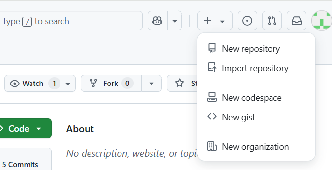

# Manual_GitHub_LP2

## INTRODUCCION

### Objetivos del manual

**1. Ofrecer una guía clara y práctica acerca del uso de GitHub.** La presente guía tiene como finalidad ofrecerle al usuario una guía accesible y comprensible que le permita usar GitHub como una plataforma central organizar, controlar y colaborar en proyectos en desarrollo.

**2. Facilitar la comprensión del concepto del control de versiones.** La guía introduce al lector sobre qué es el control de versiones y por qué es importante, qué es Git como un sistema distribuido, y cómo GitHub extiende sus funcionalidades a través de una plataforma colaborativa almacenada en la nube.

**3. Establecer un protocolo de colaboración mediante GitHub.** Busca definir procedimientos comunes (nomenclatura de ramas, revisión de código, flujos de trabajo, etc.) '''para que todos los miembros del equipo trabajen eficazmente.

### ¿Qué es GitHub y para qué se utiliza?

**GitHub** es una plataforma web que permite almacenar códigos informáticos a través de repositorios en la nube. Estos códigos pueden ser compartidos y vistos libremente por cualquier usuario, que puede realizar sugerencias de mejora. Su principal utilidad se enfoca en el **control de versiones** y el **trabajo colaborativo** a través del software de código abierto **Git**, lo cual organiza adecuadamente el trabajo, ya que, de este modo, los desarrolladores de cada proyecto podrán almacenar versiones distintas de sus códigos durante su edición.

**Ventajas de usar GitHub**

- Permite alojar proyectos y códigos en repositorios de forma gratuita
- Permite compartir y colaborar en proyectos de código en tiempo real
- Perfil personalizable en la plataforma
- Almacenamiento público (por defecto) o privado de proyectos
- Creación de páginas web estáticas con *GitHub Pages*

**¿Qué es el control de versiones?**

Es la administración de los cambios que se realizan a los elementos o a la configuración de un proyecto. Permite almacenar distintas versiones del contenido (desde la primera versión hasta la definitiva), revisar y autorizar cualquier cambio, y guardar información de cómo y cuándo se hicieron esos cambios. De esta manera, el control de versiones es una herramienta muy valiosa puesto que permite a los desarrolladores revisar las versiones anteriores del proyecto, en caso de que este empezara a fallar en su funcionamiento.

**¿Qué es Git?**
Es un software de control de versiones distribuido, creado por Linus Torvalds, que permite administrar y gestionar los cambios en la información de un proyecto con código. Su funcionamiento se basa en unas líneas de desarrollo conocidas como **ramas**, que almacenan copias independientes de los archivos de trabajo. Mediante estas ramas, cada usuario tiene la facilidad de modificar su código de forma aislada a través de confirmaciones o **"commits"**, sin afectar al código principal. Posteriormente, estas ramas son fusionadas en una rama principal, donde se consolida la versión definitiva del proyecto.

### Requisitos previos

Para utilizar GitHub, **no es necesario ser un experto en programación o sistemas**, aunque lo recomendable es tener instalado el software Git y poseer conocimientos básicos como el empleo de funciones básicas de Git (*git add*,*git commit*, *git push*), comandos básicos en la terminal, lenguajes de programación y un editor de código. Un paso fundamental para acceder a GitHub es **crear una cuenta (gratuita) en la nube de GitHub** mediante un **correo electrónico**, lo cual se puede hacer mediante el botón ***Sign up*** en la página web de GitHub.

## GESTIÓN DE REPOSITORIOS

### Creación de un repositorio

En el entorno de GitHub, un **repositorio** es un lugar donde se almacena el contenido de un proyecto, tales como códigos, archivos y el historial de revisiones para cada archivo. Pueden tener uno o muchos colaboradores y ser almacenados tanto de manera pública como privada.

Los repositorios pueden ser creados dentro de la cuenta personal o en la cuenta de alguna organización en la que el usuario cuente con permisos previos.

1. En la esquina superior derecha de la página de GitHub, hacer clic en el botón **"+"** y luego en **"New repository"**.
2. Escribir un nombre corto para el repositorio, que sea fácil de recordar.
3. Añadir una descripción al repositorio (opcional).
4. Elegir la opción de visibilidad del repositorio, si es **público** (por defecto, visible para cualquier usuario) o privado (visible para el creador y personas que tengan acceso compartido).

### Clonación y configuración inicial

### Buenas prácticas de organización

## USO DE GIT Y GITHUB

### Fundamentos de Git

### Sincronización con GitHub

### Uso de Git en el entorno GitHub